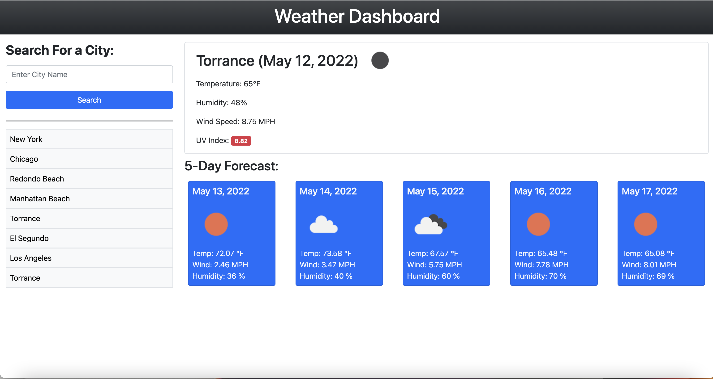

# city-weather-dashboard
A website which shows the current weather and a five-day forecast of the city you choose. 

Enter a city name of your choice into the input box and then click the 'Search' button. This will allow you to view the current weather, temperature, humidity, wind-speed, and UV index for the chosen city at the current time. The dashboard will also display the weather, temperature, humidity, and wind-speed of the next 5 days in the chosen city.

The UV index is presented with a color showing the severity of the UV. Favorable is shown in green, Moderate is shown in yellow, and severe is shown in red.

Local Storage is also used to store the search history of cities. The last 8 cities searched will be displayed on the dashboard as clickable buttons for easy access to view the weather and forecast of previously searched cities.

## Built With
* HTML
* CSS
* Javascript
* Moment.js API
* Bootstrap API
* Open Weather API

## Links
* Github Repo - https://github.com/CodySawa/city-weather-dashboard
* Deployed Application - https://codysawa.github.io/city-weather-dashboard/

## Screenshot
